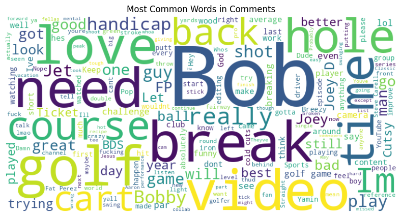

# Bob Does Sports Sentiment Analysis
**YouTube Video: "Can Bobby Fairways FINALLY Break 80?"** [Link to Video](https://www.youtube.com/watch?v=LqyprUHo4H0&t=6s)

**Released: March 6, 2025**

**Comments Sample Size: 200** 

## Executive Summary
The bottom line here is Bob’s golf is mediocre at best and his fans and video commenters still love it. Despite having a 18% negative sentiment value, further digging into those comments found that the sentiment model picked up on references to Bob’s “not-so-great” golfing ability and not in reference to a negative entertainment value. The comments labeled as negative still imply that the commenters found the video humorous, of good quality, and fully entertaining. The positive (43%) and neutral (39%) comments really highlight the humor and entertainment, including a lot a love poured out for the Bob Does Sports crew.

## Overview of Bob Does Sports
Bob Does Sports (BDS) is a YouTube channel blending golf and humor through the interactions of its main cast: Bobby Fairways, Joey Cold Cuts, and Fat Perez. Supporting cast members Jet and Ticket also serve as producers, videographers, and editors, frequently appearing on camera for entertaining banter and occasionally joining in the golf action. BDS often features collaborations with other popular YouTube personalities, including those from Good Good and Grant Horvat, as well as professional athletes from various sports (including MLB, NFL, and NHL) and Callaway Golf-sponsored PGA stars. The channel's popularity has grown rapidly over the past two to three years, reaching 988,000 subscribers as of March 2025 and will likely reach the prestigious 1 Million by mid year. They also sell merchandise under the Breezy brand name, often featuring their trademark phrase that's a reminder to not take golf (and life) too seriously, "Have a Day."

## Sentiment Analysis
The analysis in this report is from the VADER (Valence Aware Dictionary and sEntiment Reasoner) tool from the NLTK library. VADER is a pre-trained, lexicon-based sentiment analysis model specifically designed to handle text from social media, making it ideal for analyzing YouTube comments. 

VADER assigns a compound score to each comment, which represents the overall sentiment polarity: Positive Sentiment (compound score >0.05), Negative Sentiment (compound score <-0.05), and Neutral Sentiment (compound score between -0.05 and 0.05)

### Sentiment Distribution

From the distribution above, the sample of posted video comments shows to be mostly positive, as defined by the VADER tool. The word cloud below gives off the 

