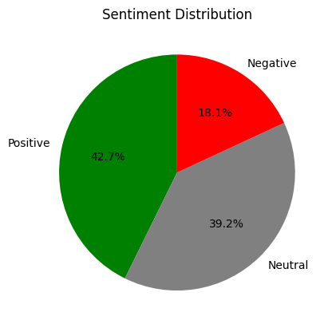

# Bob Does Sports Sentiment Analysis
**YouTube Video: "Can Bobby Fairways FINALLY Break 80?"** [Link to Video](https://www.youtube.com/watch?v=LqyprUHo4H0&t=6s)

**Released: March 6, 2025**

**Comments Sample Size: 199** 

## Executive Summary
The bottom line here is Bob’s golf is mediocre at best and his fans and video commenters still love it. Despite having a 18% negative sentiment value, further digging into those comments found that the sentiment model picked up on references to Bob’s “not-so-great” golfing ability and not in reference to a negative entertainment value. The comments labeled as negative still imply that the commenters found the video humorous, of good quality, and fully entertaining. The positive (43%) and neutral (39%) comments really highlight the humor and entertainment, including a lot a love poured out for the Bob Does Sports crew.

## Overview of Bob Does Sports
Bob Does Sports (BDS) is a YouTube channel blending golf and humor through the interactions of its main cast: Bobby Fairways, Joey Cold Cuts, and Fat Perez. Supporting cast members Jet and Ticket also serve as producers, videographers, and editors, frequently appearing on camera for entertaining banter and occasionally joining in the golf action. BDS often features collaborations with other popular YouTube personalities, including those from Good Good and Grant Horvat, as well as professional athletes from various sports (including MLB, NFL, and NHL) and Callaway Golf-sponsored PGA stars. The channel's popularity has grown rapidly over the past two to three years, reaching 988,000 subscribers as of March 2025 and will likely reach the prestigious 1 Million by mid year. They also sell merchandise under the Breezy brand name, often featuring their trademark phrase that's a reminder to not take golf (and life) too seriously, "Have a Day."

## Sentiment Analysis
The analysis in this report is from the VADER (Valence Aware Dictionary and sEntiment Reasoner) tool from the NLTK library. VADER is a pre-trained, lexicon-based sentiment analysis model specifically designed to handle text from social media, making it ideal for analyzing YouTube comments. 

VADER assigns a compound score to each comment, which represents the overall sentiment polarity: 

    Positive Sentiment (compound score >0.05)

    Negative Sentiment (compound score <-0.05)

    Neutral Sentiment (compound score between -0.05 and 0.05)

### Sentiment Distribution
From the distribution, the sample of posted video comments shows to be mostly positive, as defined by the VADER tool. The negative sentiment comes out to approximately 18%, but further exploration shows those negative comments aren't that negative (a closer look at negative sentiment is below). 

  
  
<em>Figure 1: Sentiment Distribution Determined by VADER Tool</em>

From the word cloud below, several expected terms appear, such as 'Bob,' 'Golf,' 'Course,' and 'Video,' which reflect the video's topic. However, the word 'Love' stands out, appearing in 17 comments. A closer look at these comments reveals that 'Love' is primarily used to express viewers' enjoyment of the content and/or the BDS crew.

  
  
<em>Figure 2: Word Cloud of Most Common Words of all 199 Comments</em>

#### Negative Comments

To understand where BDS could make some improvements to their videos or where the comments could have been misidentified, this report covers a more in-depth view of the comments that the VADER tool labeled as negative. The word cloud below (Figure 3) shows the most commen words used in those labeled negative comments. Again, there are more of the same words when considering all the comments from Figure 2; however, the word 'Time' sticks out as a possible negative implications of not enjoying the content or the video being too long. 

  
  
<em>Figure 3: Word Cloud of Most Common Words of Negative Comments</em>

#### Negative Comments Containing the Word "Time"

Here are the 6 comments labeled as negative that includes the word 'Time.' None of the comments are complaints about the length of the video. Most of these comments, similar to the other negative comments, are centered around Bob's golf game, which for a YouTube golfer isn't as good as most of his content provider peers. Comments #3 and #6 add in complaints about the commentary and ruckus environment of the entourage following Bob on the course; however, there are many positively labeled comments expressing why they like that kind of content from this channel. Finally, comment #4 below had to be cut off -- the commenter has too much time on their hands.  

> **1.** "How can a guy throw a strike then next **time** throw a gutter ball"

> **2.** "No matter what Im still deeply hurt to my core every **time** Bob makes a bad shot or misses a putt Bob is elite level at getting people to root for him without really trying"

> **3.** "Its really shown in the past 2 episodes how much of an empty vessel Joey is Hes just noise saying the same thing **time** after **time** White noise Joey"

> **4.** "I like bob but I stopped watching Bob a while back That said bob has consistent golf game issues Below is a brief analysis of Bobs game 1 Driver Actually his best attribute Hits roughly 50 of fairways with his driver bad choices off the tee make this worse but its his best attribute most of the **time** ...

> **5.** "I felt bad for Bobthe whole **time**"

> **6.** "Tiger Woods would have a difficult **time** playing with the circus following around the course"

## Conclusion
BDS is a fun channel, not intended to showcase great golf. The majority of the 199 commenters sampled in this report (over 80%) understand the BDS premise and either enjoy or at least accept the content and entertainment value the channel offers. Of the 18% labeled with negative sentiment, most comments focus on Bob's subpar golf skills, which are already well-known to be mediocre at best. However, Bob is making an effort and highlighting the struggle that millions of golfers face. Golf is hard. In reality, Bob shot a 90, which isn’t that bad. As the BDS crew often reminds us, 'Have a Day' and don’t take golf (or life) too seriously.

